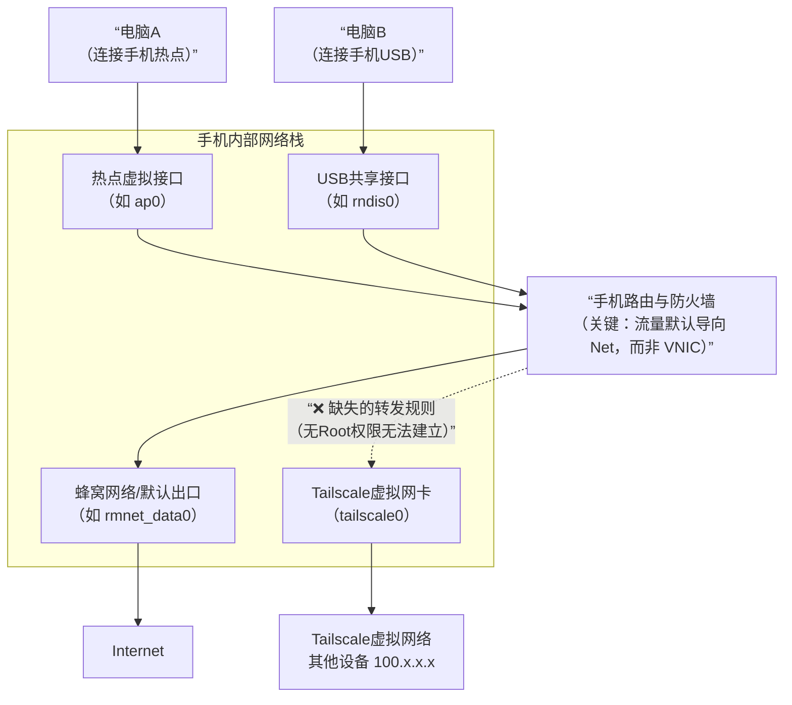
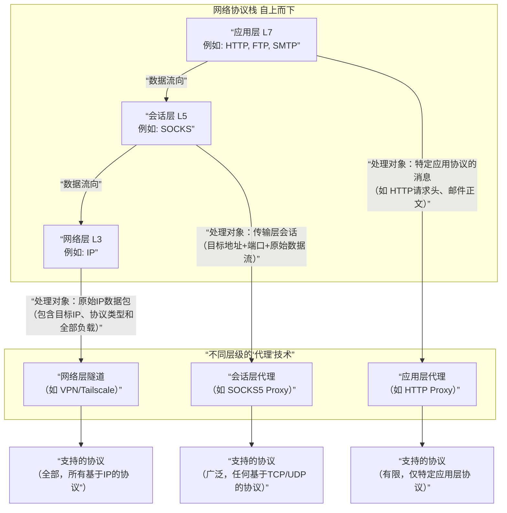

# 灵感笔记 - {2025-12-29}

## 💡 创意点

## ⚠️ 遇到的问题
1.希望通过安装了tailscale的手机共享的网络访问其他已经接入tailscale的电脑，经测试失败了
  1.从技术实现上，只要共享网络的设备能将数据包转发给Tailscale虚拟网卡，那么就可以实现。但由于移动设备没有Root权限，无法建立转发规则，所以无法实现。
  2.在手机上，通过热点、usb共享网络都是共享默认出口，而不是共享虚拟网卡的出口，即访问100.x.x.x的IP地址不会导向虚拟网卡而导致失败。

## ✅ 解决方案

## 📚 学到的知识

### 代理和vpn的区别

#### 代理和VPN在原理上的区别
1.代理运行在应用层，他拦截应用的请求，根据规则，将部分合规的请求转发给代理服务器，代理服务器再把请求转发给目标服务器。
2.VPN运行在传输层，他拦截网络数据包，他会直接获取目的的ip地址，当他目的地址在特定的网段，则会将转发给特定的虚拟网卡，先尝试在设备间建立点对点加密隧道。只有在NAT穿透失败时，才会使用备用的DERP中继服务器。
3.在性能上，VPN比代理要高，因为VPN不需要应用层拦截，不受代理服务器的带宽限制，直接将数据包转发给虚拟网卡，虚拟网卡再通过nat或者转发给tailscale服务器进行中转。
4.在安全性上，VPN比代理要高，因为VPN需要加密数据包，防止数据被监听。
5.在协议上，vpn支持所有协议，代理根据主动选择的协议进行代理，socket代理性能更高，https理论代理性能更差。
~~~~mermaid
flowchart LR
    subgraph VPNSG[VPN/Tailscale 模式]
        direction LR
        AppA[应用程序] --> OS[操作系统]
        OS -->|“1. 路由决策: 目标IP属于远程网段 2. 流量被定向至虚拟网卡”| VNIC[虚拟网卡]
        VNIC -->|“3. 整个数据包被加密 （形成隧道）”| Tunnel[VPN加密隧道]
        Tunnel -->|“4. 解密后，发往 目标网络”| Remote[远程内网设备]
    end

    subgraph ProxySG[代理模式]
        direction LR
        AppB[应用程序 （需配置代理）] -->|“1. 主动将请求 发送至代理服务器”| ProxySvr[代理服务器]
        ProxySvr -->|“2. 代表应用程序 向目标发起请求”| Internet[互联网资源]
    end
~~~~

1.https和http代理必须解析，增加了处理流程，性能更差。
2.socket代理不需要解析，性能更高。
3.vpn和代理的传输协议不同，vpn支持所有协议，代理根据主动选择的协议进行代理。

