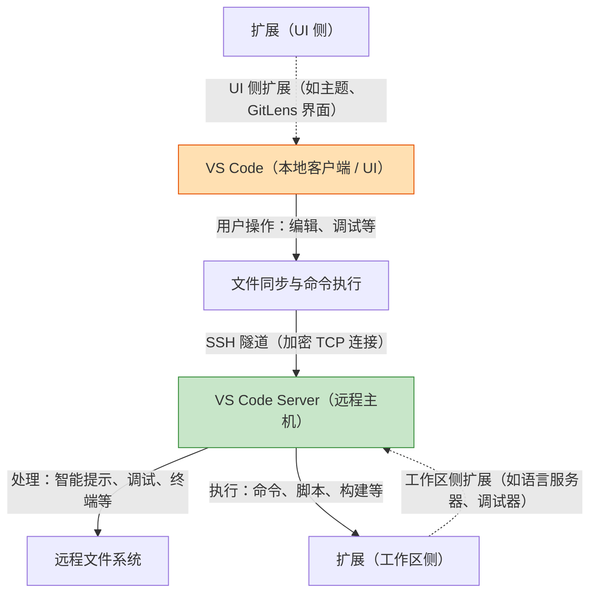

# 灵感笔记 - {2025-12-31}

## 💡 创意点

## ⚠️ 遇到的问题
1.需要通过公司电脑借助手机共享的网络上网，并通过手机安装的tailscale 进行网络穿透，连接家里的mac
    1.存在的问题是，由于tailscale、clash不能同时使用
    2.
    3.
2.需要通过代理连接mac上的vscode server,但ssh连接默认不走代理
    1.ssh -o "ProxyCommand=ncat --proxy 10.175.86.73:1080 --proxy-type socks5 %h %p" green@100.104.111.108

## ✅ 解决方案

## 📚 学到的知识

